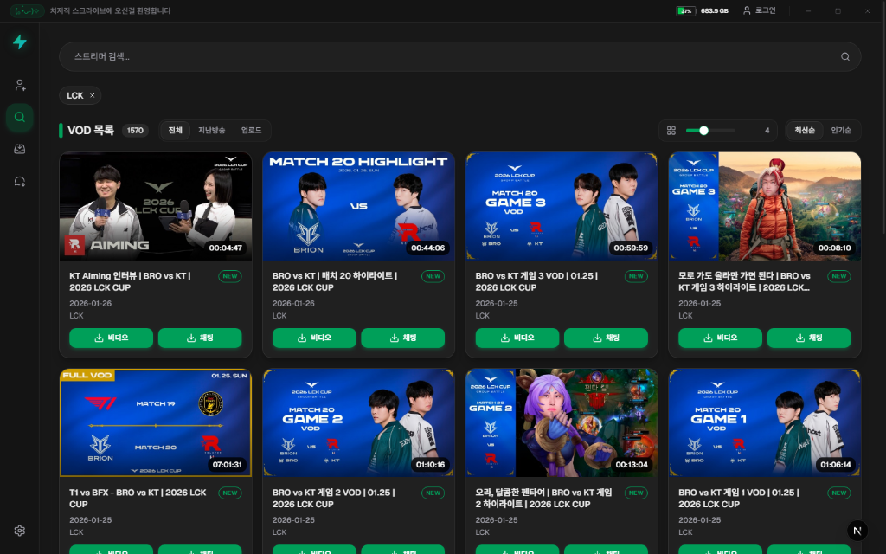

# Chzzk Scribe (치지직 스크라이브)

치지직(Chzzk) VOD 및 채팅 데이터를 손쉽게 다운로드하고 관리할 수 있는 데스크탑 어플리케이션입니다.

  

## ✨ 주요 기능

- **채팅 자막 변환**: 채팅 내역을 추출하여 실제 방송 화면의 오버레이처럼 보이는 **ASS 자막**으로 변환 가능합니다. (VOD 다운로드는 덤 입니다)

## 🔒 보안 및 개인정보 보호

Chzzk Scribe는 사용자의 보안과 개인정보를 최우선으로 생각하며, 다음과 같은 원칙을 준수합니다.

- **데이터 투명성**: 모든 네트워크 통신은 치지직 및 네이버 공식 도메인(`*.naver.com`, `*.pstatic.net` 등)으로만 한정됩니다. 사용자의 데이터를 외부 서버로 전송하지 않습니다.
- **안전한 저장**: 네이버 로그인 세션 정보는 **Electron safeStorage API**를 사용하여 OS 수준에서 암호화되어 로컬에 저장됩니다.
- **프로세스 제어**: `streamlink` 등 영상 다운로드에 필수적인 외부 도구만을 제어하며, 시스템에 무해한 안전한 API(`shell.openPath` 등)를 사용합니다.

### ⚠️ 실행 시 "안전하지 않은 앱" 경고가 뜨는 경우
Chzzk Scribe는 별도의 유료 인증서(Code Signing)를 사용하지 않는 오픈소스 프로젝트입니다. 이 때문에 Windows의 **스마트 앱 컨트롤(Smart App Control)**이나 **SmartScreen**에 의해 차단될 수 있습니다.

**해결 방법:**
1. 다운로드 받은 `.exe` 파일에서 마우스 오른쪽 버튼을 클릭하고 **[속성]**을 선택합니다.
2. 하단의 **보안** 항목에서 **[차단 해제]** 체크박스를 선택하고 **[확인]**을 누릅니다.
3. 앱을 다시 실행하면 정상적으로 동작합니다.

상세한 내부 구조 및 동작 원리는 [ARCHITECTURE.md](ARCHITECTURE.md)를 참고해 주세요.

## 📝 라이선스
이 프로젝트는 **MIT License**에 따라 자유롭게 이용, 수정 및 배포가 가능합니다. AI와 함께 만들어진 프로젝트인 만큼 누구나 편하게 사용하고 발전시켜 나갈 수 있습니다.
