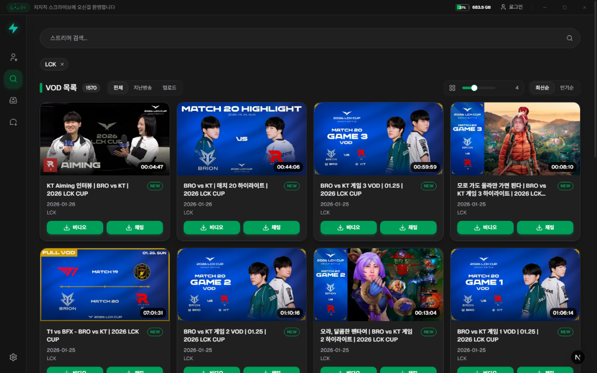

# Chzzk Scribe (치지직 스크라이브)

치지직(Chzzk) VOD 및 채팅 데이터를 손쉽게 다운로드하고 관리할 수 있는 데스크탑 어플리케이션입니다.

<p align="center">
  
</p>

## ✨ 주요 기능

- **다시 보기 다운로드**: 치지직 VOD 영상을 고화질로 다운로드할 수 있습니다.
- **채팅 자막 변환**: 채팅 내역을 추출하여 실제 방송 화면의 오버레이처럼 보이는 **ASS 자막**으로 변환합니다.
- **CLI 워크플로우**: 스트리머 검색, VOD 목록 조회, VOD 다운로드, 채팅 로그 다운로드, 스트림 로그 병합을 터미널에서 실행할 수 있습니다.
- **방송 분석 기능**: 
  - Faster-Whisper를 활용한 음성 인식으로 방송 음성을 텍스트로 변환
  - 음성과 채팅을 결합한 **스트림 로그** 자동 생성
  - 스트림 로그 기반 AI 버튜버용 페르소나 추출
  - 백그라운드 작업 큐로 여러 작업 동시 처리
  - GPU 가속 지원 (NVIDIA GPU 권장)

## CLI 사용법

개발 환경에서는 다음처럼 실행할 수 있습니다.

```bash
node bin/chzzk-scribe.js --help
node bin/chzzk-scribe.js search "스트리머명" --json
node bin/chzzk-scribe.js vods <channelId> --size 10 --json
node bin/chzzk-scribe.js download <vodId> --out ./downloads --quality best
node bin/chzzk-scribe.js chat <vodId> --out ./downloads
node bin/chzzk-scribe.js stream-log --chat chat.json --srt transcript.srt --out stream-log.md
node bin/chzzk-scribe.js persona stream-log.md --provider openai --model gpt-5.5 --out persona.md
```

OpenAI 호환 OAuth 제공자는 PKCE 브라우저 인증을 사용할 수 있습니다.

```bash
node bin/chzzk-scribe.js openai login \
  --client-id <client-id> \
  --auth-url <authorization-url> \
  --token-url <token-url>
node bin/chzzk-scribe.js openai status
```

참고: OpenAI Platform API는 일반적으로 API key 방식을 사용합니다. OAuth는 제공자가 authorization/token endpoint를 제공하는 경우에 사용하세요.


## � 다운로드 및 설치

### 최신 릴리스
[GitHub Releases](https://github.com/amuro33/chzzk-scribe/releases)에서 최신 버전을 다운로드하세요.

### 설치 방법

**1. 인스톨러 버전 (권장)**
- `chzzk-scribe x.x.x Installer.exe` 다운로드
- 설치 프로그램 실행 후 안내에 따라 설치
- 바탕화면 및 시작 메뉴 바로가기 자동 생성

**2. 포터블 버전**
- `chzzk-scribe x.x.x Portable.zip` 다운로드
- 원하는 폴더에 압축 해제
- `chzzk-scribe.exe` 실행
- 별도 설치 없이 사용 가능, USB 등에 담아 이동 가능

### 시스템 요구사항
- OS: Windows 10/11 (64-bit)
- RAM: 4GB 이상 (AI 분석 시 8GB 권장)
- 디스크: 최소 10GB 여유 공간
- GPU: AI 분석 시 NVIDIA GPU 권장 (선택사항)

## �🔒 보안 및 개인정보 보호

Chzzk Scribe는 사용자의 보안과 개인정보를 최우선으로 생각하며, 다음과 같은 원칙을 준수합니다.

- **데이터 투명성**: 모든 네트워크 통신은 치지직 및 네이버 공식 도메인(`*.naver.com`, `*.pstatic.net` 등)으로만 한정됩니다. 사용자의 데이터를 외부 서버로 전송하지 않습니다.
- **안전한 저장**: 네이버 로그인 세션 정보는 **Electron safeStorage API**를 사용하여 OS 수준에서 암호화되어 로컬에 저장됩니다.
- **프로세스 제어**: `streamlink` 등 영상 다운로드에 필수적인 외부 도구만을 제어하며, 시스템에 무해한 안전한 API(`shell.openPath` 등)를 사용합니다.

### ⚠️ 실행 시 "안전하지 않은 앱" 경고가 뜨는 경우
Chzzk Scribe는 별도의 유료 인증서(Code Signing)를 사용하지 않는 오픈소스 프로젝트입니다. 이 때문에 Windows의 **스마트 앱 컨트롤(Smart App Control)**이나 **SmartScreen**에 의해 차단될 수 있습니다.

**해결 방법:**
1. 다운로드 받은 `.exe` 파일에서 마우스 오른쪽 버튼을 클릭하고 **[속성]**을 선택합니다.
2. 하단의 **보안** 항목에서 **[차단 해제]** 체크박스를 선택하고 **[확인]**을 누릅니다.
3. 앱을 다시 실행하면 정상적으로 동작합니다.

상세한 내부 구조 및 동작 원리는 [ARCHITECTURE.md](ARCHITECTURE.md)를 참고해 주세요.

## 📝 라이선스
이 프로젝트는 **MIT License**에 따라 자유롭게 이용, 수정 및 배포가 가능합니다. AI와 함께 만들어진 프로젝트인 만큼 누구나 편하게 사용하고 발전시켜 나갈 수 있습니다.
